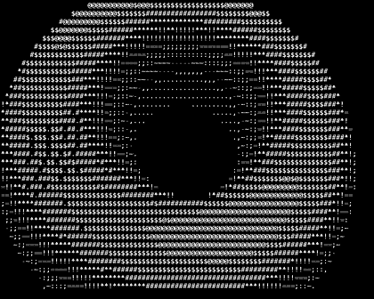

# SpinningDonut

A pure **x86-64 Linux assembly** spinning torus renderer for terminal output — no C runtime, no libc, just syscalls and math.

## Highlights

- Pure assembly (`src/main.asm`) with direct Linux syscalls
- Dynamic terminal-size rendering (with bounds clamping for safety)
- Z-buffered ASCII shading
- Mouse tracking support (when your terminal supports xterm mouse reporting)
- Reproducible build flow via `Makefile`
- GitHub Actions CI for build + smoke test
- Manual-trigger GitHub Release pipeline with packaged binaries + SHA256 checksums
- Hardened runtime error handling and safe terminal cleanup paths

## Demo



Run it yourself:

- Build: `make build`
- Run: `make run`

Exit with `Ctrl+C`.

## Controls

- `Ctrl+C`: quit
- Mouse movement: adjusts rotation angles when terminal mouse reporting is available

## Requirements

- Linux (x86-64)
- `gcc` (used as assembler/linker driver)
- `make`
- `timeout` (for smoke test target)

## Build & Test

```bash
make build
make smoke-test
```

`make smoke-test` runs the renderer briefly to validate that it starts correctly.

For full, release-grade validation:

```bash
make verify
```

This performs a clean rebuild, runtime smoke checks, output sanity checks, artifact packaging, and checksum verification.

## Build Targets

- `make build` — build static binary
- `make run` — run interactive renderer
- `make smoke-test` — short non-interactive runtime test
- `make verify` — comprehensive validation pipeline
- `make workflow-test` — workflow lint + local release simulation
- `make package` — generate release artifacts in `dist/`

## Project Layout

- `src/main.asm` — renderer and runtime
- `Makefile` — build/run/validation/package targets
- `scripts/validate.sh` — strict local validation script
- `scripts/test-workflows.sh` — local CI/release workflow simulation
- `assets/demo.gif` — README demo capture
- `CONTRIBUTING.md` — contribution guidelines
- `SECURITY.md` — security reporting policy
- `CHANGELOG.md` — release history
- `LICENSE` — MIT

## License

Licensed under the MIT License. See `LICENSE`.
